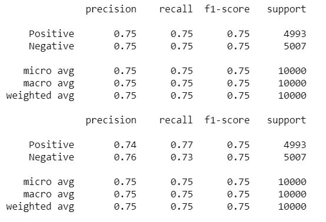

# Final-Project-IMDB-Reviews
UNC Data Analytics Bootcamp Capstone Project: Comparing Deep Learning Models on IMDB Movie Review Sentiment Analysis
Team: Ali, Chris, Lissette, Shannon, Victor

## Goals and insights
Determine whether a movie review is positive or negative and check if there is a dfference in accuracy between Deep and non-deep learning methods

### Skills
(3 different models - Non - deep learning model with KNN and SVM, Deep Learning using Tensforflow/Keras, Bag of Words model) --- Ali, Chris, and Lissette

### Data preprocessing
BeautifulSoup to scrape reviews in dataset
NLTK to get a list of stop words
SciKit-Learn, RandomForest Classifier, Bag of Words (CountVectorizer) model to create train and test datasets
TensorFlow and Keras to do the neural network models and scoring 

Visualization ideas: (SciKit, Matplotlib, D3.js) --- Shannon and Victor
Confusion Matrix for each model
Range bar chart to compare scores between two models across # of epochs 
Bubble charts of word frequency for positive and negative reviews 

### Results

Helpful links:
Animated guide to machine learning: http://www.r2d3.us/visual-intro-to-machine-learning-part-1/

Kaggle's tutorial: https://www.kaggle.com/c/word2vec-nlp-tutorial/overview/part-1-for-beginners-bag-of-words

Intro to bag of words model: https://machinelearningmastery.com/gentle-introduction-bag-words-model/

Google's word2vec: https://code.google.com/archive/p/word2vec/
